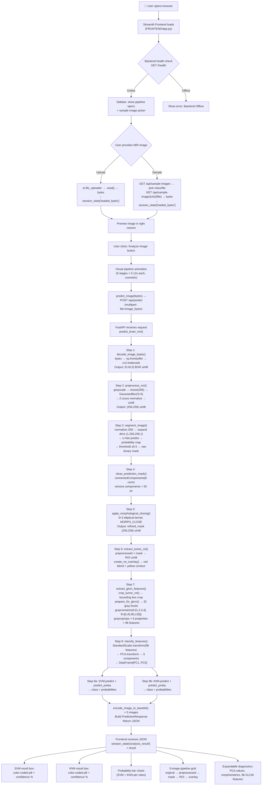

# Brain Tumor Analysis System — Complete End-to-End Code Flow Analysis

> [!NOTE]
> This document is based **strictly on your actual code**. No assumptions, no invented functionality. Every reference points to the real file and line number.

---

## Table of Contents
1. [Project Architecture Overview](#1-project-architecture-overview)
2. [Frontend Flow](#2-frontend-flow)
3. [API Communication](#3-api-communication)
4. [Backend Flow](#4-backend-flow)
5. [ML Inference Flow (Verified from Code)](#5-ml-inference-flow-verified-from-code)
6. [Data Flow — Format at Every Stage](#6-data-flow--format-at-every-stage)
7. [Model Interaction](#7-model-interaction)
8. [Frontend Result Flow](#8-frontend-result-flow)
9. [File-by-File Explanation](#9-file-by-file-explanation)
10. [Complete Flow Diagram](#10-complete-flow-diagram)

---

## 1. Project Architecture Overview

Your project is a **two-process client-server application**:

| Layer | Technology | Entry Point |
|-------|-----------|-------------|
| **Frontend** | Streamlit (Python) | [`FRONTEND/app.py`](file:///c:/Users/harsh/OneDrive/Documents/BE_Major_Project/FRONTEND/app.py) |
| **Backend** | FastAPI (Python) | [`BACKEND/main.py`](file:///c:/Users/harsh/OneDrive/Documents/BE_Major_Project/BACKEND/main.py) |
| **ML Models** | TensorFlow (U-Net), scikit-learn (SVM, KNN) | [`BACKEND/models.py`](file:///c:/Users/harsh/OneDrive/Documents/BE_Major_Project/BACKEND/models.py) |

The two processes communicate over **HTTP REST API** on `http://127.0.0.1:8000`.

### How the app is started

**Backend** — you run [`run_backend.py`](file:///c:/Users/harsh/OneDrive/Documents/BE_Major_Project/run_backend.py):
```text
python run_backend.py
  → uvicorn.run("BACKEND.main:app", host="127.0.0.1", port=8000)
  → FastAPI app starts
  → lifespan() fires → model_manager.load_all_models() loads U-Net, Scaler, PCA, SVM, KNN into memory
```

**Frontend** — you run [`app.py`](file:///c:/Users/harsh/OneDrive/Documents/BE_Major_Project/app.py) (root-level):
```text
python app.py
  → runpy.run_path("FRONTEND/app.py")
  → Streamlit app launches in browser
```

Or directly: `streamlit run FRONTEND/app.py`

---

## 2. Frontend Flow

### 2.1 Which file starts the application

[`FRONTEND/app.py`](file:///c:/Users/harsh/OneDrive/Documents/BE_Major_Project/FRONTEND/app.py) is the Streamlit application. It can be launched either directly or via the root-level [`app.py`](file:///c:/Users/harsh/OneDrive/Documents/BE_Major_Project/app.py) which uses `runpy.run_path()` to execute it.

### 2.2 What happens when the page loads

When a user opens the browser, Streamlit executes [`FRONTEND/app.py`](file:///c:/Users/harsh/OneDrive/Documents/BE_Major_Project/FRONTEND/app.py) **top to bottom** on every interaction. Here's the sequence:

1. **Page config** is set ([Line 36-40](file:///c:/Users/harsh/OneDrive/Documents/BE_Major_Project/FRONTEND/app.py#L36-L40)): title = "Brain Tumor Analysis | AI Medical Diagnosis", layout = "wide", sidebar expanded.

2. **CSS injection** ([Lines 43-238](file:///c:/Users/harsh/OneDrive/Documents/BE_Major_Project/FRONTEND/app.py#L43-L238)): A large block of custom CSS is injected via `st.markdown(unsafe_allow_html=True)` for the medical dashboard styling (header cards, pipeline badges, classification result boxes, image grid cards, etc.)

3. **Sidebar renders** ([Lines 242-295](file:///c:/Users/harsh/OneDrive/Documents/BE_Major_Project/FRONTEND/app.py#L242-L295)):
   - Calls [`check_backend_health()`](file:///c:/Users/harsh/OneDrive/Documents/BE_Major_Project/FRONTEND/utils.py#L25-L31) → sends `GET /health` to the backend
   - If online: shows green "Connected" status
   - If online: calls [`get_backend_info()`](file:///c:/Users/harsh/OneDrive/Documents/BE_Major_Project/FRONTEND/utils.py#L34-L42) → sends `GET /api/info` to display pipeline specifications
   - Calls [`get_sample_images()`](file:///c:/Users/harsh/OneDrive/Documents/BE_Major_Project/FRONTEND/utils.py#L45-L53) → sends `GET /api/sample-images` to populate two selectboxes: Tumor Class and MRI Scan file
   - "Load Selected Sample MRI" button: when clicked, calls [`get_sample_image_bytes()`](file:///c:/Users/harsh/OneDrive/Documents/BE_Major_Project/FRONTEND/utils.py#L56-L65) → sends `GET /api/sample-image/{class_name}/{filename}` → stores the returned bytes in `st.session_state["loaded_bytes"]`

4. **Main header** renders ([Lines 298-307](file:///c:/Users/harsh/OneDrive/Documents/BE_Major_Project/FRONTEND/app.py#L298-L307)): blue gradient card with "Brain Tumor Analysis System".

5. **Upload section** ([Lines 310-341](file:///c:/Users/harsh/OneDrive/Documents/BE_Major_Project/FRONTEND/app.py#L310-L341)):
   - Left column: `st.file_uploader` accepting `.jpg`, `.jpeg`, `.png`
   - Right column: preview of the currently loaded image

6. **Analyze button** ([Lines 344-353](file:///c:/Users/harsh/OneDrive/Documents/BE_Major_Project/FRONTEND/app.py#L344-L353)): "Analyze Image" button, disabled if no image is loaded or backend is offline.

### 2.3 How the MRI image is uploaded or selected

**Two paths to get an image:**

**Path A — Direct Upload:**
- User drags/drops or picks a file via `st.file_uploader` ([Line 314](file:///c:/Users/harsh/OneDrive/Documents/BE_Major_Project/FRONTEND/app.py#L314))
- On upload, `uploaded_file.read()` is called ([Line 322](file:///c:/Users/harsh/OneDrive/Documents/BE_Major_Project/FRONTEND/app.py#L322)) to get raw bytes
- Bytes are stored in `st.session_state["loaded_bytes"]`
- Filename stored in `st.session_state["loaded_filename"]`

**Path B — Sample Image from sidebar:**
- User selects a class and filename from dropdowns
- Clicks "Load Selected Sample MRI"
- [`get_sample_image_bytes()`](file:///c:/Users/harsh/OneDrive/Documents/BE_Major_Project/FRONTEND/utils.py#L56-L65) fetches the image from the backend via `GET /api/sample-image/{class_name}/{filename}`
- Returned bytes are stored in `st.session_state["loaded_bytes"]` ([Line 285](file:///c:/Users/harsh/OneDrive/Documents/BE_Major_Project/FRONTEND/app.py#L285))

### 2.4 How the image is stored and passed around

The image lives as **raw bytes** in Streamlit's session state:
- `st.session_state["loaded_bytes"]` — the raw image bytes (from upload or sample fetch)
- `st.session_state["loaded_filename"]` — the filename string
- `st.session_state["analysis_result"]` — the JSON response from the backend (set after analysis)

The preview reads `current_bytes` from session state ([Line 331](file:///c:/Users/harsh/OneDrive/Documents/BE_Major_Project/FRONTEND/app.py#L331)), converts it to a PIL image using `Image.open(BytesIO(current_bytes))`, and displays it.

### 2.5 What happens when the user clicks "Analyze Image"

When `analyze_clicked` is `True` and `current_bytes` is not `None` ([Line 373](file:///c:/Users/harsh/OneDrive/Documents/BE_Major_Project/FRONTEND/app.py#L373)):

1. **Visual pipeline animation** ([Lines 374-394](file:///c:/Users/harsh/OneDrive/Documents/BE_Major_Project/FRONTEND/app.py#L374-L394)):
   - Iterates through 8 hardcoded `PIPELINE_STAGES` ([Lines 362-371](file:///c:/Users/harsh/OneDrive/Documents/BE_Major_Project/FRONTEND/app.py#L362-L371))
   - For each stage, renders HTML badges showing completed (✓), active (●), and pending (○) stages
   - A CSS progress bar fills proportionally
   - Each step has a `time.sleep(0.12)` delay for visual animation
   - **This is purely cosmetic** — the actual backend call hasn't happened yet

2. **Actual backend API call** ([Lines 397-413](file:///c:/Users/harsh/OneDrive/Documents/BE_Major_Project/FRONTEND/app.py#L397-L413)):
   - Calls [`predict_image(current_bytes, filename=current_filename, base_url=API_BASE_URL)`](file:///c:/Users/harsh/OneDrive/Documents/BE_Major_Project/FRONTEND/utils.py#L68-L87)
   - This sends a `POST` request to `/api/predict` with the image bytes as multipart form data
   - The returned JSON is stored in `st.session_state["analysis_result"]`
   - On success, the pipeline badges are all updated to show "✓" completed
   - On failure, an error message is shown and `analysis_result` is set to `None`

### 2.6 How the frontend communicates with the backend

All communication happens via **HTTP requests using the `requests` library**, defined in [`FRONTEND/utils.py`](file:///c:/Users/harsh/OneDrive/Documents/BE_Major_Project/FRONTEND/utils.py). Every request includes the header `{"ngrok-skip-browser-warning": "true"}` (for ngrok tunnel compatibility). The base URL defaults to `http://127.0.0.1:8000`.

---

## 3. API Communication

### Complete endpoint map (verified from code):

| # | HTTP Method | Endpoint | Frontend Function | What is Sent | What Backend Returns |
|---|------------|----------|-------------------|-------------|---------------------|
| 1 | `GET` | `/health` | [`check_backend_health()`](file:///c:/Users/harsh/OneDrive/Documents/BE_Major_Project/FRONTEND/utils.py#L25-L31) | Nothing (no body) | `{"status": "healthy", "models_loaded": true/false}` |
| 2 | `GET` | `/api/info` | [`get_backend_info()`](file:///c:/Users/harsh/OneDrive/Documents/BE_Major_Project/FRONTEND/utils.py#L34-L42) | Nothing | `SystemInfoResponse` JSON (status, version, target_classes, input_resolution, models_loaded, classifier_notes) |
| 3 | `GET` | `/api/sample-images` | [`get_sample_images()`](file:///c:/Users/harsh/OneDrive/Documents/BE_Major_Project/FRONTEND/utils.py#L45-L53) | Nothing | `{"glioma": ["file1.jpg", ...], "meningioma": [...], "pituitary": [...]}` — up to 10 filenames per class |
| 4 | `GET` | `/api/sample-image/{class_name}/{filename}` | [`get_sample_image_bytes()`](file:///c:/Users/harsh/OneDrive/Documents/BE_Major_Project/FRONTEND/utils.py#L56-L65) | Nothing (class & filename are URL path params) | Raw JPEG image bytes (`image/jpeg`) |
| 5 | **`POST`** | **`/api/predict`** | [**`predict_image()`**](file:///c:/Users/harsh/OneDrive/Documents/BE_Major_Project/FRONTEND/utils.py#L68-L87) | **Multipart form: `file=(filename, image_bytes, "image/jpeg")`** | **Full `PredictionResponse` JSON** (see below) |

### The critical `/api/predict` request-response:

**Request:**
```python
files = {"file": (filename, image_bytes, "image/jpeg")}
requests.post(f"{base_url}/api/predict", files=files, headers=REQUEST_HEADERS, timeout=60)
```

**Response (PredictionResponse JSON):**
```json
{
  "status": "success",
  "stages": [...],       // List of pipeline stage names & descriptions
  "images": {
    "original": "data:image/png;base64,...",
    "preprocessed": "data:image/png;base64,...",
    "segmentation_mask": "data:image/png;base64,...",
    "extracted_roi": "data:image/png;base64,...",
    "roi_overlay": "data:image/png;base64,..."
  },
  "svm": {
    "model_name": "Support Vector Machine (SVM)",
    "prediction": "glioma",
    "score": 94.52,
    "score_type": "SVM predict_proba probability",
    "score_unit": "%",
    "probabilities": {"glioma": 94.52, "meningioma": 3.21, "pituitary": 2.27},
    "decision_scores": null
  },
  "knn": {
    "model_name": "K-Nearest Neighbors (KNN)",
    "prediction": "glioma",
    "score": 80.00,
    "score_type": "KNN predict_proba posterior probability",
    "score_unit": "%",
    "probabilities": {"glioma": 80.0, "meningioma": 20.0, "pituitary": 0.0}
  },
  "metadata": {
    "glcm_features_extracted": true,
    "glcm_features_count": 96,
    "glcm_feature_names": ["contrast_d1_a0", ...],
    "glcm_feature_values": [0.123, ...],
    "pca_applied": true,
    "pca_components_count": 5,
    "pca_components": [1.234, -0.567, ...],
    "segmentation_model": "U-Net",
    "tumor_detected": true,
    "tumor_pixel_count": 4523,
    "tumor_area_percentage": 6.9,
    "execution_time_ms": 1234.5
  }
}
```

---

## 4. Backend Flow

### 4.1 Application startup

When [`run_backend.py`](file:///c:/Users/harsh/OneDrive/Documents/BE_Major_Project/run_backend.py) is executed:

1. `uvicorn.run("BACKEND.main:app", ...)` imports [`BACKEND/main.py`](file:///c:/Users/harsh/OneDrive/Documents/BE_Major_Project/BACKEND/main.py)
2. At module level, `model_manager = ModelManager()` is imported from [`BACKEND/models.py`](file:///c:/Users/harsh/OneDrive/Documents/BE_Major_Project/BACKEND/models.py#L159) — this creates the singleton but does **not** load models yet
3. The FastAPI `lifespan` context manager ([Lines 30-41](file:///c:/Users/harsh/OneDrive/Documents/BE_Major_Project/BACKEND/main.py#L30-L41)) fires during startup
4. [`model_manager.load_all_models()`](file:///c:/Users/harsh/OneDrive/Documents/BE_Major_Project/BACKEND/models.py#L33-L70) is called, which loads **all 5 artifacts** into memory:
   - `best_unet.keras` → `self.unet` (TensorFlow Keras model, ~373 MB)
   - `scaler.pkl` → `self.scaler` (sklearn StandardScaler)
   - `pca.pkl` → `self.pca` (sklearn PCA)
   - `final_svm.pkl` → `self.svm` (sklearn SVC)
   - `pca_knn_glcm.joblib` → `self.knn` (sklearn KNeighborsClassifier)
5. CORS middleware is added to allow all origins ([Lines 52-58](file:///c:/Users/harsh/OneDrive/Documents/BE_Major_Project/BACKEND/main.py#L52-L58))

### 4.2 Request handling — the `/api/predict` route

When the frontend sends `POST /api/predict`, the request is handled by [`predict_brain_mri()`](file:///c:/Users/harsh/OneDrive/Documents/BE_Major_Project/BACKEND/main.py#L125-L284).

Here is the **exact execution order** traced through the code:

```text
Step 1 — Read & Validate Upload              (main.py L141-L147)
Step 2 — Preprocessing                       (main.py L157-L159)
Step 3 — U-Net Segmentation + Post-process   (main.py L167-L176)
Step 4 — Extract Tumor ROI & Overlay         (main.py L189-L190)
Step 5 — GLCM Feature Extraction             (main.py L198-L212)
Step 6 — Standardize + PCA + SVM + KNN       (main.py L215-L220)
Step 7 — Encode images to Base64             (main.py L235-L241)
Step 8 — Build response and return           (main.py L243-L284)
```

---

## 5. ML Inference Flow (Verified from Code)

> [!IMPORTANT]
> I verified the actual order from your code. The order you provided in your question is **correct** — it matches exactly what the code does.

Here is the precise flow with the exact function calls:

### Step 1: Image Validation & Decoding
**File:** [`BACKEND/main.py`](file:///c:/Users/harsh/OneDrive/Documents/BE_Major_Project/BACKEND/main.py#L141-L147) → [`BACKEND/utils.py`](file:///c:/Users/harsh/OneDrive/Documents/BE_Major_Project/BACKEND/utils.py#L6-L14)

```text
image_bytes = await file.read()          # Read uploaded bytes from UploadFile
raw_image = decode_image_bytes(image_bytes)
  → np.frombuffer(image_bytes, np.uint8)   # bytes → numpy uint8 array
  → cv2.imdecode(np_arr, IMREAD_UNCHANGED) # decode into HxWxC BGR image
```
**Input:** raw bytes from HTTP multipart upload
**Output:** `raw_image` — numpy array shape `(H, W, 3)` BGR uint8

### Step 2: Preprocessing
**File:** [`BACKEND/main.py`](file:///c:/Users/harsh/OneDrive/Documents/BE_Major_Project/BACKEND/main.py#L157-L159) → [`BACKEND/preprocessing.py`](file:///c:/Users/harsh/OneDrive/Documents/BE_Major_Project/BACKEND/preprocessing.py#L50-L59)

Two things happen here:

```text
orig_gray = convert_to_grayscale(raw_image)  # BGR → Grayscale
orig_resized = resize_image(orig_gray, (256, 256))  # For overlay visualization later

preprocessed = preprocess_mri(raw_image)
  → gray = convert_to_grayscale(image)       # cv2.cvtColor(BGR2GRAY)
  → resized = resize_image(gray, (256, 256)) # cv2.resize with INTER_AREA
  → denoised = denoise_image(resized)        # cv2.GaussianBlur (3×3, sigma=0)
  → normalized = z_score_normalization(denoised)
      → float32 conversion
      → Z = (pixel - mean) / std
      → cv2.normalize to [0, 255]
      → cast back to uint8
```
**Input:** `raw_image` — BGR uint8 `(H, W, 3)`
**Output:** `preprocessed` — grayscale uint8 `(256, 256)`, values 0–255

### Step 3: U-Net Segmentation
**File:** [`BACKEND/main.py`](file:///c:/Users/harsh/OneDrive/Documents/BE_Major_Project/BACKEND/main.py#L168) → [`BACKEND/models.py`](file:///c:/Users/harsh/OneDrive/Documents/BE_Major_Project/BACKEND/models.py#L72-L101)

```text
prob_map, raw_mask, cleaned_mask, refined_mask = model_manager.segment_image(preprocessed)

Inside segment_image():
  → image_norm = preprocessed / 255.0        # uint8 → float32 [0,1]
  → model_input = expand_dims(axis=(0, -1))   # shape: (1, 256, 256, 1)
  → pred = self.unet.predict(model_input)      # U-Net forward pass
  → probability_map = pred[0, :, :, 0]         # shape: (256, 256) float32
  → raw_mask = (prob_map >= 0.5).astype(uint8)  # Binary thresholding
  → cleaned_mask = clean_prediction_mask(raw_mask)  # Remove components < 50px
  → refined_mask = apply_morphological_closing(cleaned_mask)  # Fill holes
```

### Step 4: Morphological Processing (inside Step 3)
**File:** [`BACKEND/segmentation.py`](file:///c:/Users/harsh/OneDrive/Documents/BE_Major_Project/BACKEND/segmentation.py#L10-L48)

```text
clean_prediction_mask(raw_mask):
  → cv2.connectedComponentsWithStats(mask, connectivity=8)
  → For each component: keep only if area >= 50 pixels
  → Returns cleaned_mask (small noise removed)

apply_morphological_closing(cleaned_mask):
  → kernel = cv2.getStructuringElement(MORPH_ELLIPSE, (3,3))
  → cv2.morphologyEx(mask, MORPH_CLOSE, kernel, iterations=1)
  → Returns refined_mask (holes filled, edges smoothed)
```

### Step 5: Tumor ROI Extraction
**File:** [`BACKEND/main.py`](file:///c:/Users/harsh/OneDrive/Documents/BE_Major_Project/BACKEND/main.py#L189-L190) → [`BACKEND/segmentation.py`](file:///c:/Users/harsh/OneDrive/Documents/BE_Major_Project/BACKEND/segmentation.py#L51-L63)

```text
roi = extract_tumor_roi(preprocessed, refined_mask)
  → image_float = preprocessed / 255.0    # Normalize to [0, 1]
  → roi_float = image_float * refined_mask  # Multiply: only tumor pixels survive
  → roi_uint8 = (roi_float * 255).uint8    # Back to [0, 255]

roi_overlay = create_roi_overlay(orig_resized, refined_mask)
  → Convert grayscale to RGB
  → Create red layer, alpha-blend at 50% where mask is True
  → Draw yellow contour border (thickness=2) around tumor boundary
```
**Input:** preprocessed `(256,256)` uint8 + refined_mask `(256,256)` binary
**Output:** `roi` — `(256,256)` uint8 (tumor pixels visible, rest black), `roi_overlay` — `(256,256,3)` RGB

### Step 6: GLCM Feature Extraction
**File:** [`BACKEND/main.py`](file:///c:/Users/harsh/OneDrive/Documents/BE_Major_Project/BACKEND/main.py#L198) → [`BACKEND/features.py`](file:///c:/Users/harsh/OneDrive/Documents/BE_Major_Project/BACKEND/features.py#L51-L84)

```text
glcm_feat = extract_glcm_features(roi)

Inside extract_glcm_features():
  1. crop_tumor_roi(roi)
     → np.where(roi > 0)  → find non-zero pixel coordinates
     → Crop to bounding box [y_min:y_max+1, x_min:x_max+1]
     → Returns cropped_roi (tight bounding box around tumor)

  2. prepare_for_glcm(cropped_roi)
     → cv2.normalize to range [0, 31]  (GLCM_LEVELS = 32)
     → Returns roi_quantized (32 gray levels)

  3. graycomatrix(roi_quantized,
        distances=[1,2,3,4],
        angles=[0, π/4, π/2, 3π/4],
        levels=32, symmetric=True, normed=True)
     → Returns GLCM matrix

  4. For each of 6 properties × 4 distances × 4 angles:
     → graycoprops(glcm, property_name)
     → Flatten values into a 1D array
     → Total: 6 × 4 × 4 = 96 features
```

**The 6 GLCM properties** (from [`config.py`](file:///c:/Users/harsh/OneDrive/Documents/BE_Major_Project/BACKEND/config.py#L28)):
`contrast`, `dissimilarity`, `homogeneity`, `energy`, `correlation`, `ASM`

**Input:** `roi` — `(256,256)` uint8
**Output:** `glcm_feat` — numpy float32 array of shape `(96,)`

### Step 7: Standardization → PCA → SVM + KNN
**File:** [`BACKEND/main.py`](file:///c:/Users/harsh/OneDrive/Documents/BE_Major_Project/BACKEND/main.py#L216) → [`BACKEND/models.py`](file:///c:/Users/harsh/OneDrive/Documents/BE_Major_Project/BACKEND/models.py#L103-L155)

```text
pca_values, svm_data, knn_data = model_manager.classify_features(glcm_feat)

Inside classify_features():

  1. STANDARDIZATION
     scaled_feat = self.scaler.transform([glcm_feat])
     → StandardScaler fitted on training data
     → Input: (1, 96) raw GLCM features
     → Output: (1, 96) zero-mean unit-variance features

  2. PCA DIMENSIONALITY REDUCTION
     pca_feat_raw = self.pca.transform(scaled_feat)
     → PCA fitted on training data
     → Input: (1, 96) scaled features
     → Output: (1, 5) — 5 principal components

     pca_df = pd.DataFrame(pca_feat_raw, columns=["PC1","PC2","PC3","PC4","PC5"])
     → Wraps in DataFrame with column names to match training format

  3. SVM CLASSIFICATION
     svm_pred = self.svm.predict(pca_df)[0]           → predicted class string
     svm_probs = self.svm.predict_proba(pca_df)[0]     → probabilities per class
     svm_conf = svm_probs[predicted_class_index] * 100  → confidence %

  4. KNN CLASSIFICATION
     knn_pred = self.knn.predict(pca_df)[0]           → predicted class string
     knn_probs = self.knn.predict_proba(pca_df)[0]     → posterior probabilities
     knn_conf = knn_probs[predicted_class_index] * 100  → confidence %
```

**Input:** 96 GLCM features → **Output:** class predictions + probabilities for both SVM and KNN

---

## 6. Data Flow — Format at Every Stage

```text
Stage                    │ Data Format                              │ Shape / Type
─────────────────────────┼──────────────────────────────────────────┼──────────────────────
Uploaded file            │ HTTP multipart form data                 │ UploadFile object
  ↓                      │                                          │
Raw bytes                │ Python bytes object                      │ bytes (variable size)
  ↓                      │                                          │
Decoded image            │ OpenCV BGR numpy array                   │ (H, W, 3) uint8
  ↓                      │                                          │
Grayscale                │ Single-channel numpy array               │ (H, W) uint8
  ↓                      │                                          │
Resized                  │ 256×256 grayscale                        │ (256, 256) uint8
  ↓                      │                                          │
Denoised                 │ Gaussian-blurred grayscale               │ (256, 256) uint8
  ↓                      │                                          │
Z-score normalized       │ Preprocessed image (0–255)               │ (256, 256) uint8
  ↓                      │                                          │
U-Net input              │ Normalized float + batch + channel dims  │ (1, 256, 256, 1) float32
  ↓                      │                                          │
Probability map          │ Pixel-wise tumor probability             │ (256, 256) float32 [0,1]
  ↓                      │                                          │
Raw binary mask          │ Thresholded at 0.5                       │ (256, 256) uint8 {0, 1}
  ↓                      │                                          │
Cleaned mask             │ Small components removed                 │ (256, 256) uint8 {0, 1}
  ↓                      │                                          │
Refined mask             │ Morphologically closed                   │ (256, 256) uint8 {0, 1}
  ↓                      │                                          │
ROI (tumor pixels)       │ preprocessed × mask → uint8              │ (256, 256) uint8
  ↓                      │                                          │
Cropped ROI              │ Tight bounding box crop                  │ (h, w) uint8 (variable)
  ↓                      │                                          │
Quantized ROI            │ Normalized to 32 gray levels             │ (h, w) uint8 [0, 31]
  ↓                      │                                          │
GLCM matrix              │ Co-occurrence matrix                     │ (32, 32, 4, 4) float64
  ↓                      │                                          │
GLCM features            │ 96 Haralick texture values               │ (96,) float32
  ↓                      │                                          │
Scaled features          │ Zero-mean, unit-variance                 │ (1, 96) float64
  ↓                      │                                          │
PCA features             │ 5 principal components                   │ (1, 5) float64
  ↓                      │                                          │
PCA DataFrame            │ Pandas DF with column names              │ (1, 5) DataFrame
  ↓                      │                                          │
SVM prediction           │ Class label + probabilities              │ str + (3,) float array
KNN prediction           │ Class label + probabilities              │ str + (3,) float array
  ↓                      │                                          │
Images → Base64          │ cv2.imencode → base64 → data URL string  │ str (data:image/png;...)
  ↓                      │                                          │
JSON response            │ PredictionResponse Pydantic model        │ Dict → JSON
  ↓                      │                                          │
Frontend display         │ Parsed JSON dict in session_state        │ Python dict
```

---

## 7. Model Interaction

### 7.1 Where each model is loaded

All models are loaded in [`ModelManager.load_all_models()`](file:///c:/Users/harsh/OneDrive/Documents/BE_Major_Project/BACKEND/models.py#L33-L70), called once during FastAPI startup:

| Model | File on Disk | Load Method | Line |
|-------|-------------|-------------|------|
| **U-Net** | [`MODELS/best_unet.keras`](file:///c:/Users/harsh/OneDrive/Documents/BE_Major_Project/MODELS) (373 MB) | `tf.keras.models.load_model(path, compile=False)` | [Line 41](file:///c:/Users/harsh/OneDrive/Documents/BE_Major_Project/BACKEND/models.py#L41) |
| **Scaler** | [`Features/scaler.pkl`](file:///c:/Users/harsh/OneDrive/Documents/BE_Major_Project/Features) (3 KB) | `joblib.load(path)` | [Line 46](file:///c:/Users/harsh/OneDrive/Documents/BE_Major_Project/BACKEND/models.py#L46) |
| **PCA** | [`Features/pca.pkl`](file:///c:/Users/harsh/OneDrive/Documents/BE_Major_Project/Features) (21 KB) | `joblib.load(path)` | [Line 51](file:///c:/Users/harsh/OneDrive/Documents/BE_Major_Project/BACKEND/models.py#L51) |
| **SVM** | [`MODELS/final_svm.pkl`](file:///c:/Users/harsh/OneDrive/Documents/BE_Major_Project/MODELS) (731 KB) | `joblib.load(path)` | [Line 56](file:///c:/Users/harsh/OneDrive/Documents/BE_Major_Project/BACKEND/models.py#L56) |
| **KNN** | [`MODELS/pca_knn_glcm.joblib`](file:///c:/Users/harsh/OneDrive/Documents/BE_Major_Project/MODELS) (809 KB) | `joblib.load(path)` | [Line 61](file:///c:/Users/harsh/OneDrive/Documents/BE_Major_Project/BACKEND/models.py#L61) |

### 7.2 What each model receives and produces

| Model | Input | Output |
|-------|-------|--------|
| **U-Net** | `(1, 256, 256, 1)` float32 [0,1] — single grayscale preprocessed MRI | `(1, 256, 256, 1)` float32 — pixel-wise tumor probability map |
| **StandardScaler** | `(1, 96)` — raw 96 GLCM features | `(1, 96)` — standardized features (zero mean, unit variance) |
| **PCA** | `(1, 96)` — standardized features | `(1, 5)` — 5 principal component scores |
| **SVM** | `DataFrame(1, 5)` columns `[PC1..PC5]` | `predict()` → class string (`"glioma"` / `"meningioma"` / `"pituitary"`); `predict_proba()` → `(3,)` float array of class probabilities |
| **KNN** | `DataFrame(1, 5)` columns `[PC1..PC5]` | `predict()` → class string; `predict_proba()` → `(3,)` float array of posterior probabilities |

### 7.3 How predictions are returned to the frontend

After classification, [`main.py`](file:///c:/Users/harsh/OneDrive/Documents/BE_Major_Project/BACKEND/main.py#L235-L284) constructs a `PredictionResponse` Pydantic model containing:
- All 5 pipeline images encoded as base64 data URLs
- SVM result (prediction, score %, probabilities per class)
- KNN result (prediction, score %, probabilities per class)
- Metadata (GLCM feature names/values, PCA component values, tumor stats, execution time)

FastAPI automatically serializes this Pydantic model to JSON and returns it with `Content-Type: application/json`.

---

## 8. Frontend Result Flow

After the backend returns the JSON response, the frontend stores it in `st.session_state["analysis_result"]` and displays it ([Lines 420-592](file:///c:/Users/harsh/OneDrive/Documents/BE_Major_Project/FRONTEND/app.py#L420-L592)):

### 8.1 Classification result display

The result dict is unpacked ([Lines 424-427](file:///c:/Users/harsh/OneDrive/Documents/BE_Major_Project/FRONTEND/app.py#L424-L427)):
```python
svm_data = result["svm"]
knn_data = result["knn"]
meta = result["metadata"]
images = result["images"]
```

**SVM + KNN prediction display** ([Lines 442-469](file:///c:/Users/harsh/OneDrive/Documents/BE_Major_Project/FRONTEND/app.py#L442-L469)):
- Two side-by-side result boxes in a CSS grid
- Each shows:
  - Model name (SVM or KNN)
  - **Color-coded prediction pill**: red for glioma, yellow for meningioma, blue for pituitary (via `get_class_pill()` helper, [Lines 430-439](file:///c:/Users/harsh/OneDrive/Documents/BE_Major_Project/FRONTEND/app.py#L430-L439))
  - **Confidence score** in large bold text (e.g., `94.52%`)
- A verification badge row shows: GLCM extracted (96), PCA applied (5 components), U-Net segmentation, tumor pixel count, and latency

### 8.2 Probability bar charts

**SVM probabilities** ([Lines 473-482](file:///c:/Users/harsh/OneDrive/Documents/BE_Major_Project/FRONTEND/app.py#L473-L482)):
- Creates a Pandas DataFrame from `svm_data["probabilities"]` dict
- Displays as `st.bar_chart()` (height 180)

**KNN probabilities** ([Lines 484-490](file:///c:/Users/harsh/OneDrive/Documents/BE_Major_Project/FRONTEND/app.py#L484-L490)):
- Same pattern with `knn_data["probabilities"]`

### 8.3 Five-image pipeline visualization

([Lines 493-556](file:///c:/Users/harsh/OneDrive/Documents/BE_Major_Project/FRONTEND/app.py#L493-L556)) — 5 columns, each with a styled image card:

| Column | Image Key | What it Shows |
|--------|-----------|---------------|
| 1 | `images["original"]` | Original uploaded MRI (as-is) |
| 2 | `images["preprocessed"]` | After grayscale + resize + denoise + Z-score |
| 3 | `images["segmentation_mask"]` | U-Net refined binary mask (white = tumor) |
| 4 | `images["extracted_roi"]` | Tumor pixels only, rest is black |
| 5 | `images["roi_overlay"]` | Original with red tumor highlight + yellow contour |

Each base64 data URL string is converted to a PIL Image using [`base64_to_pil()`](file:///c:/Users/harsh/OneDrive/Documents/BE_Major_Project/FRONTEND/utils.py#L90-L97):
```python
# Splits on comma to get the base64 part, decodes, opens as PIL Image
b64_str = b64_data_url.split(",")[1]
image_bytes = base64.b64decode(b64_str)
Image.open(BytesIO(image_bytes))
```

### 8.4 Detailed diagnostics (expandable section)

([Lines 559-591](file:///c:/Users/harsh/OneDrive/Documents/BE_Major_Project/FRONTEND/app.py#L559-L591)) — wrapped in `st.expander()`:

- **PCA Coordinates**: DataFrame showing PC1–PC5 score values from `meta["pca_components"]`
- **Segmentation Morphometrics**: Dictionary displaying resolution, tumor pixel count, area %, morphological kernel, component filter threshold, U-Net threshold
- **GLCM Feature Table**: Full 96-row DataFrame from `meta["glcm_feature_names"]` and `meta["glcm_feature_values"]` with scrollable container (height 320)

---

## 9. File-by-File Explanation

### [`app.py`](file:///c:/Users/harsh/OneDrive/Documents/BE_Major_Project/app.py) (root)
| Function | What it Does | Called By | Calls |
|----------|-------------|-----------|-------|
| (module-level) | Uses `runpy.run_path()` to execute `FRONTEND/app.py` | User via `python app.py` | `FRONTEND/app.py` |

---

### [`run_backend.py`](file:///c:/Users/harsh/OneDrive/Documents/BE_Major_Project/run_backend.py)
| Function | What it Does | Called By | Calls |
|----------|-------------|-----------|-------|
| `__main__` block | Starts uvicorn with `BACKEND.main:app` on port 8000 | User via `python run_backend.py` | `uvicorn.run()` |

---

### [`BACKEND/config.py`](file:///c:/Users/harsh/OneDrive/Documents/BE_Major_Project/BACKEND/config.py)
| Item | What it Does | Used By |
|------|-------------|---------|
| `PROJECT_ROOT`, `MODELS_DIR`, `DATASET_DIR`, `FEATURES_DIR` | Path constants for project directories | `models.py`, `main.py` |
| `UNET_MODEL_PATH`, `SCALER_PATH`, `PCA_PATH`, `SVM_MODEL_PATH`, `KNN_MODEL_PATH` | Full paths to model files | `models.py` |
| `IMG_SIZE=256` | Target image resolution | `preprocessing.py`, `main.py` |
| `UNET_THRESHOLD=0.5` | Sigmoid threshold for U-Net mask | `models.py` |
| `MIN_COMPONENT_AREA=50` | Minimum connected component size | `segmentation.py` |
| `MORPH_KERNEL_SIZE=(3,3)`, `MORPH_ITERATIONS=1` | Morphological closing params | `segmentation.py` |
| `GLCM_DISTANCES=[1,2,3,4]`, `GLCM_ANGLES=[0,π/4,π/2,3π/4]`, `GLCM_LEVELS=32`, `GLCM_PROPERTIES=[6 props]` | GLCM computation parameters | `features.py` |
| `CLASS_NAMES=["glioma","meningioma","pituitary"]` | Target classification labels | `models.py`, `main.py` |

---

### [`BACKEND/utils.py`](file:///c:/Users/harsh/OneDrive/Documents/BE_Major_Project/BACKEND/utils.py)
| Function | What it Does | Called By | Calls |
|----------|-------------|-----------|-------|
| `decode_image_bytes(bytes)` → `np.ndarray` | Converts raw bytes → numpy array → OpenCV image via `cv2.imdecode` | `main.py` L145 | `np.frombuffer`, `cv2.imdecode` |
| `encode_image_to_base64(image)` → `str` | Converts numpy image → PNG bytes → base64 → data URL string. Handles binary masks by scaling {0,1} → {0,255} | `main.py` L236-L240 | `cv2.imencode`, `base64.b64encode` |

---

### [`BACKEND/preprocessing.py`](file:///c:/Users/harsh/OneDrive/Documents/BE_Major_Project/BACKEND/preprocessing.py)
| Function | What it Does | Called By | Calls |
|----------|-------------|-----------|-------|
| `convert_to_grayscale(image)` → `np.ndarray` | If already 2D, returns as-is. Otherwise `cv2.cvtColor(BGR2GRAY)` | `main.py` L157, `preprocess_mri()` | `cv2.cvtColor` |
| `resize_image(image, size)` → `np.ndarray` | `cv2.resize` with `INTER_AREA` interpolation | `main.py` L158, `preprocess_mri()` | `cv2.resize` |
| `denoise_image(image)` → `np.ndarray` | `cv2.GaussianBlur` with 3×3 kernel, sigma=0 | `preprocess_mri()` | `cv2.GaussianBlur` |
| `z_score_normalization(image)` → `np.ndarray` | Z = (X−μ)/σ, then `cv2.normalize` to [0,255], cast to uint8 | `preprocess_mri()` | `np.mean`, `np.std`, `cv2.normalize` |
| **`preprocess_mri(image)`** → `np.ndarray` | **Master pipeline**: grayscale → resize(256) → denoise → z-score | `main.py` L159 | All 4 functions above |

---

### [`BACKEND/segmentation.py`](file:///c:/Users/harsh/OneDrive/Documents/BE_Major_Project/BACKEND/segmentation.py)
| Function | What it Does | Called By | Calls |
|----------|-------------|-----------|-------|
| `clean_prediction_mask(mask, min_area=50)` → `np.ndarray` | Connected component analysis (8-connectivity). Removes components with area < 50 pixels | `models.py` L96 | `cv2.connectedComponentsWithStats` |
| `apply_morphological_closing(mask, kernel=(3,3), iter=1)` → `np.ndarray` | Creates 3×3 elliptical kernel, applies `MORPH_CLOSE` to fill small holes | `models.py` L99 | `cv2.getStructuringElement`, `cv2.morphologyEx` |
| `extract_tumor_roi(image, mask)` → `np.ndarray` | Normalizes image to [0,1], multiplies by mask, scales back to [0,255] | `main.py` L189 | numpy ops |
| `create_roi_overlay(image, mask)` → `np.ndarray` | Creates RGB image, blends red at 50% opacity on tumor region, draws yellow contour borders | `main.py` L190 | `cv2.cvtColor`, `cv2.addWeighted`, `cv2.findContours`, `cv2.drawContours` |

---

### [`BACKEND/features.py`](file:///c:/Users/harsh/OneDrive/Documents/BE_Major_Project/BACKEND/features.py)
| Function | What it Does | Called By | Calls |
|----------|-------------|-----------|-------|
| `crop_tumor_roi(roi)` → `np.ndarray or None` | Finds non-zero pixel bounding box, crops to tight rectangle | `extract_glcm_features()` | `np.where`, `np.min`, `np.max` |
| `prepare_for_glcm(roi)` → `np.ndarray or None` | Normalizes pixel values to [0, 31] (32 gray levels) for GLCM computation | `extract_glcm_features()` | `cv2.normalize` |
| **`extract_glcm_features(roi)`** → `np.ndarray(96,) or None` | **Crops → quantizes → computes GLCM → extracts 6 properties × 4 distances × 4 angles = 96 features** | `main.py` L198 | `crop_tumor_roi`, `prepare_for_glcm`, `graycomatrix`, `graycoprops` |
| `create_feature_names()` → `list[str]` | Generates 96 feature names like `"contrast_d1_a0"` | `main.py` L212 | — |

---

### [`BACKEND/models.py`](file:///c:/Users/harsh/OneDrive/Documents/BE_Major_Project/BACKEND/models.py)
| Function | What it Does | Called By | Calls |
|----------|-------------|-----------|-------|
| `ModelManager.__init__()` | Initializes all model slots to `None`, sets `is_loaded=False` | Module import (singleton at L159) | — |
| `ModelManager.load_all_models()` | Loads U-Net (.keras), Scaler (.pkl), PCA (.pkl), SVM (.pkl), KNN (.joblib) from disk | `lifespan()` in `main.py` L37 | `tf.keras.models.load_model`, `joblib.load` |
| `ModelManager.segment_image(preprocessed)` | Normalizes → expands dims → U-Net predict → threshold → clean → morph close | `main.py` L168 | `unet.predict`, `clean_prediction_mask`, `apply_morphological_closing` |
| `ModelManager.classify_features(glcm_feat)` | Scaler transform → PCA transform → SVM predict/predict_proba → KNN predict/predict_proba | `main.py` L216 | `scaler.transform`, `pca.transform`, `svm.predict`, `svm.predict_proba`, `knn.predict`, `knn.predict_proba` |

---

### [`BACKEND/schemas.py`](file:///c:/Users/harsh/OneDrive/Documents/BE_Major_Project/BACKEND/schemas.py)
Defines Pydantic response models. **No logic** — these are data structure definitions:
| Class | Purpose |
|-------|---------|
| `PipelineStage` | name + status + description for each pipeline step |
| `ClassificationModelResult` | model_name, prediction, score, score_type, probabilities, decision_scores |
| `PipelineImages` | 5 base64 data URL strings (original, preprocessed, mask, ROI, overlay) |
| `PipelineMetadata` | GLCM info, PCA info, segmentation stats, execution time |
| `PredictionResponse` | Top-level response: status + stages + images + svm + knn + metadata |
| `SystemInfoResponse` | Backend info for `/api/info` endpoint |

---

### [`BACKEND/main.py`](file:///c:/Users/harsh/OneDrive/Documents/BE_Major_Project/BACKEND/main.py)
| Function/Route | What it Does | Called By | Calls |
|----------------|-------------|-----------|-------|
| `lifespan(app)` | Async context manager: loads all models on startup, prints shutdown msg | FastAPI lifecycle | `model_manager.load_all_models()` |
| `GET /` | Returns status, service name, models_ready | Any HTTP client | — |
| `GET /health` | Returns health status + models_loaded flag | `check_backend_health()` | — |
| `GET /api/info` | Returns system metadata (classes, resolution, notes) | `get_backend_info()` | — |
| `GET /api/sample-images` | Scans `DATASET/Classification/test/` for up to 10 .jpg files per class | `get_sample_images()` | `Path.glob()` |
| `GET /api/sample-image/{class}/{file}` | Reads and returns raw image bytes from disk | `get_sample_image_bytes()` | `open()`, `read()` |
| **`POST /api/predict`** | **The main inference pipeline** (Steps 1–8 described in Section 4) | **`predict_image()`** | `decode_image_bytes`, `preprocess_mri`, `model_manager.segment_image`, `extract_tumor_roi`, `create_roi_overlay`, `extract_glcm_features`, `model_manager.classify_features`, `encode_image_to_base64` |

---

### [`FRONTEND/utils.py`](file:///c:/Users/harsh/OneDrive/Documents/BE_Major_Project/FRONTEND/utils.py)
| Function | What it Does | Called By | Calls |
|----------|-------------|-----------|-------|
| `get_api_base_url()` → `str` | Reads API URL from env/secrets, defaults to `http://127.0.0.1:8000` | Module load (L21) | `os.getenv`, `st.secrets.get` |
| `check_backend_health(url)` → `bool` | `GET /health`, returns True if 200 | `FRONTEND/app.py` L246 | `requests.get` |
| `get_backend_info(url)` → `dict or None` | `GET /api/info`, returns parsed JSON | `FRONTEND/app.py` L257 | `requests.get` |
| `get_sample_images(url)` → `dict` | `GET /api/sample-images`, returns class→filenames mapping | `FRONTEND/app.py` L276 | `requests.get` |
| `get_sample_image_bytes(cls, file, url)` → `bytes or None` | `GET /api/sample-image/{cls}/{file}`, returns raw bytes | `FRONTEND/app.py` L283 | `requests.get` |
| **`predict_image(bytes, filename, url)`** → `dict` | **`POST /api/predict`** with multipart file upload, returns JSON | `FRONTEND/app.py` L399 | `requests.post` |
| `base64_to_pil(b64_url)` → `PIL.Image` | Strips data URL header, decodes base64, opens as PIL | `FRONTEND/app.py` L508-L556 | `base64.b64decode`, `Image.open` |

---

### [`FRONTEND/app.py`](file:///c:/Users/harsh/OneDrive/Documents/BE_Major_Project/FRONTEND/app.py)
| Section | Lines | What it Does |
|---------|-------|-------------|
| Page config + CSS | 36–238 | Sets page title, injects medical dashboard CSS |
| Sidebar | 242–295 | Health check, pipeline specs, sample image picker |
| Header | 298–307 | Blue gradient header card |
| Upload section | 310–341 | File uploader + image preview |
| Analyze button | 344–353 | Primary button, disabled when no image or backend offline |
| Pipeline animation | 362–394 | 8-stage visual progress animation (cosmetic, 0.12s per step) |
| Backend call | 397–417 | Calls `predict_image()`, stores result in session state |
| Results display | 420–591 | SVM/KNN cards, probability charts, 5 pipeline images, detailed diagnostics |

---

## 10. Complete Flow Diagram



---

## Quick Verbal Summary (for your viva)

> "Our system is a two-process application. The **Streamlit frontend** lets users upload an MRI or pick a test sample. When they click Analyze, the image bytes are sent via a **POST request to the FastAPI backend**. The backend first **decodes and preprocesses** the image — converting to grayscale, resizing to 256×256, applying Gaussian denoising, and Z-score normalization. Then the preprocessed image goes through our **U-Net deep learning model** which outputs a pixel-wise tumor probability map. We threshold at 0.5 to get a binary mask, then **clean it** by removing small connected components under 50 pixels and **morphologically close** it using a 3×3 elliptical kernel to fill holes. From this refined mask, we **extract the tumor ROI** by masking the preprocessed image. The ROI is cropped to its bounding box, quantized to 32 gray levels, and we compute a **GLCM (Gray-Level Co-occurrence Matrix)** across 4 distances and 4 angles, extracting 6 statistical properties for a total of **96 texture features**. These features are **standardized** using a saved StandardScaler, then **reduced to 5 principal components via PCA**. Finally, both an **SVM and KNN classifier** predict the tumor type — glioma, meningioma, or pituitary — with class probabilities. The backend sends back a JSON response containing the predictions, probabilities, all 5 pipeline images as base64, and the full feature data. The frontend displays everything: color-coded classification pills, confidence scores, probability bar charts, the 5-stage image pipeline, and an expandable panel with PCA values and all 96 GLCM features."

---

> [!TIP]
> **Key numbers to remember for viva:**
> - Image size: **256×256**
> - U-Net threshold: **0.5**
> - Min component area: **50 px**
> - Morphological kernel: **3×3 elliptical**
> - GLCM levels: **32**
> - GLCM distances: **[1, 2, 3, 4]** (4 values)
> - GLCM angles: **[0°, 45°, 90°, 135°]** (4 values)
> - GLCM properties: **6** (contrast, dissimilarity, homogeneity, energy, correlation, ASM)
> - Total GLCM features: **6 × 4 × 4 = 96**
> - PCA components: **5**
> - Target classes: **3** (glioma, meningioma, pituitary)
> - Classifiers: **SVM + KNN** (both use predict_proba)
